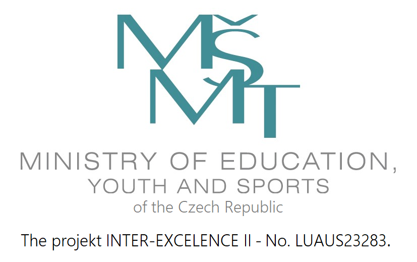

__Welcome to DMR 2025, the 6th International Workshop on Designing Meaning Representations!__

__DMR 2025 will be held at Charles University in beautiful Prague, Czechia, August 4, 2025.__

__New: Registration for DMR 2025 is now open! The registration form is [here](https://docs.google.com/forms/d/e/1FAIpQLSfj2dZE9L_R1vSBlBfPXfs_6ZYUC-QIEiox9UFr06uYwL9IEg/viewform). Registration is FREE and includes access to all DMR 2025 events, including the social dinner on August 4.__

## Important Dates

| Direct submission deadline     | April 28, 2025     |
|:------------------------------:|:------------------:|
| __ARR commitment deadline__    | __May 30, 2025__   |
| __Notification of acceptance__ | __June 16, 2025__  |
| __Camera-ready papers due__    | __July 1, 2025__   |
| __Workshop date__              | __August 4, 2025__ |

All deadlines are 11:59PM UTC-12:00 ("anywhere on Earth").

## Call for Papers

DMR 2025 invites the submissions of long and short papers about original works on the design, processing, and use of meaning representations. While deep learning methods have led to many breakthroughs in practical natural language applications, there is still a sense among many NLP researchers that we have a long way to go before we can develop systems that can actually "understand" human language and explain the decisions they make. Indeed, "understanding" natural language entails many different human-like capabilities, and they include but are not limited to the ability to track entities in a text, understand the relations between these entities, track events and their participants described in a text, understand how events unfold in time, and distinguish events that have actually happened from events that are planned or intended, are uncertain, or did not happen at all. We believe a critical step in achieving natural language understanding is to design meaning representations for text that have the necessary meaning "ingredients" that help us achieve these capabilities. Such meaning representations can also potentially be used to evaluate the compositional generalization capacity of deep learning models.

There has been a growing body of research devoted to the design, annotation, and parsing of meaning representations in recent years. In particular, formal meaning representation frameworks such as Minimal Recursion Semantics (MRS) and Discourse Representation Theory are developed with the goal of supporting logical inference in reasoning-based AI systems and are therefore easily translatable into first-order logic, while other meaning representation frameworks such as Abstract Meaning Representation (AMR), Uniform Meaning Representation (UMR), Tecto-grammatical Representation (TR) in Prague Dependency Treebanks and the Universal Conceptual Cognitive Annotation (UCCA), put more emphasis on the representation of core predicate-argument structure. The automatic parsing of natural language text into these meaning representations and the generation of natural language text from these meaning representations are also very active areas of research, and a wide range of technical approaches and learning methods have been applied to these problems.

DMR intends to bring together researchers who are producers and consumers of meaning representations and, through their interaction, gain a deeper understanding of the key elements of meaning representations that are the most valuable to the NLP community. The workshop will provide an opportunity for meaning representation researchers to present new frameworks and to critically examine existing frameworks with the goal of using their findings to inform the design of next-generation meaning representations. One particular goal is to understand the relationship between distributed meaning representations trained on large data sets using network models and the symbolic meaning representations that are carefully designed and annotated by NLP researchers, with an aim of gaining a deeper understanding of areas where each type of meaning representation is the most effective.

The workshop solicits papers that address one or more of the following topics:
- Development and annotation of meaning representations;
- Challenges and techniques in leveraging meaning representations for downstream applications, including neuro-symbolic approaches;
- The relationship between symbolic meaning representations and distributed semantic representations;
- Issues in applying meaning representations to multilingual settings and lower-resourced languages;
- Challenges and techniques in automatic parsing of meaning representations;
- Challenges and techniques in automatically generating text from meaning representations;
- Meaning representation evaluation metrics;
- Cross-framework comparison of meaning representations and their formal properties;
- Any other topics that address the design, processing, and use of meaning representations.

## Sponsors

Supported in part by:

