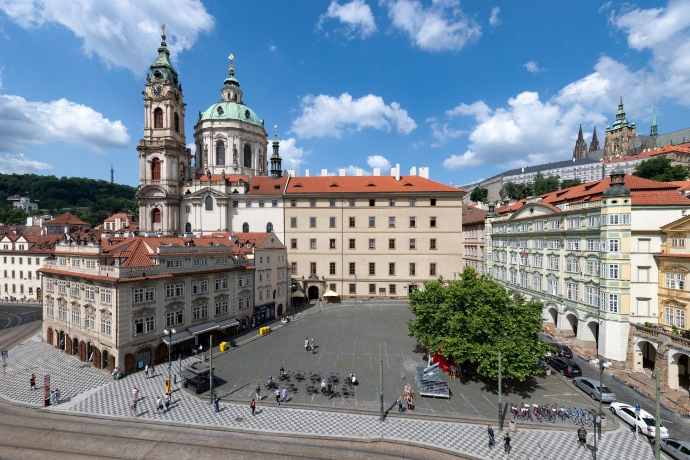
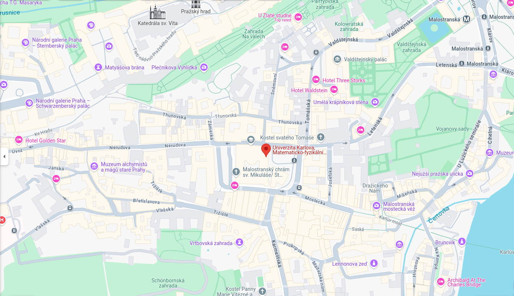

## Venue

DMR 2025 will take place at Charles University, Prague, on the Malá Strana Campus. The address is [Malostranské nám. 2/25, 118 00 Prague 1](https://maps.app.goo.gl/UuTwLcR67XcJqdmk8); the Malostranské náměstí tram stop is in front of the building, and the Malostranská metro station (line A) is a 10-minute walk away.

## Hotels

Attendees are free to book their own accommodation; lodging at a variety of price points is available across the city. A few hotels within walking distance of the workshop venue (< 5 min.) include:

- [Hotel u tří pštrosů (Hotel At The Three Ostriches)](https://www.utripstrosu.eu/en/) - right at the bottom of the Charles Bridge (about $140-170 per night)
- [Hotel Pod věží](https://www.podvezi.com/en/) - at the Malostranská tower ("věž") of the Charles Bridge ($200-250 per night for 1-2, incl. breakfast)
- [Hotel Čertovka](https://www.certovka.cz/en/) - at the "Devil's Channel" near Vltava River (about $140-200 per night for 1-2)
